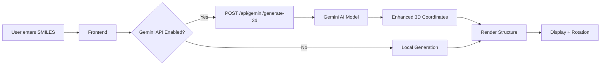

# 🧬 BioPredictSafety - Quick Start

## ✅ What's Available

### 1. **Gemini AI Integration**

- 📦 `@google/generative-ai` package installed
- 🤖 AI-powered 3D molecular structure generation
- 💊 **NEW: Medicine Photo Analysis** - Upload photos of medicine packaging!
- 🌐 API endpoints:
  - `POST /api/gemini/generate-3d` - Generate 3D structure
  - `POST /api/gemini/insights` - Get molecular insights
  - `POST /api/compounds/analyze-image` - Analyze medicine photos

### 2. **Enhanced Frontend**

- ⚡ Automatic Gemini API integration in molecular visualization
- 🔄 Smart fallback to local generation if API fails
- ✨ "AI-Enhanced" badge when using Gemini
- 📸 **NEW: Photo upload tab** in compound input
- 💊 **NEW: Medicine insights display** with safety information
- ⏳ Loading indicators for all operations

### 3. **External API Integrations**

- 🏥 **RxNorm API** - Drug name validation
- 🏛️ **OpenFDA API** - Official FDA drug label data
- 🧪 **PubChem API** - Chemical compound verification

### 4. **Configuration Files**

- 📄 `.env.example` - Template for environment variables
- 📖 `GEMINI_3D_README.md` - Gemini AI documentation
- 📖 `MEDICINE_PHOTO_ANALYSIS.md` - Photo analysis technical docs
- 📖 `MEDICINE_PHOTO_QUICK_START.md` - Photo analysis getting started
- 🔧 `setup-gemini.sh` - Interactive setup script

## 🚀 Setup in 3 Steps

### Step 1: Get Your API Key

```bash
# Visit Google AI Studio
https://makersuite.google.com/app/apikey
```

1. Sign in with Google
2. Click "Create API Key"
3. Copy the key

### Step 2: Configure

```bash
# Option A: Use the setup script
./setup-gemini.sh

# Option B: Manual setup
cp .env.example .env
# Edit .env and add: GEMINI_API_KEY=your_key_here
```

### Step 3: Run

```bash
npm install  # Install new @google/generative-ai package
npm run dev  # Start the server
```

## 🎯 How It Works



## 🌟 Features

### Molecular Structure Analysis

- ✅ Accurate bond angles (tetrahedral, trigonal, linear)
- ✅ Proper ring planarity for aromatic systems
- ✅ Natural 3D conformations
- ✅ Chemical knowledge-driven positioning
- ✅ Energetically favorable arrangements

### Medicine Photo Analysis 📸 NEW!

- 📱 Upload photos of medicine packaging (blisters, bottles, boxes)
- 🤖 Gemini Vision AI analyzes and extracts information
- 💊 Get medicine name, ingredients, dosage, warnings
- 🏥 External API validation (RxNorm, OpenFDA, PubChem)
- ⚗️ Auto-verification and molecular analysis
- 🔒 Privacy-first: Images not stored, analyzed in-memory only

### User Experience

- 🎨 Beautiful 3D visualization with drag-to-rotate
- 📥 Download as PNG
- 🖼️ Fullscreen mode
- 🔄 Reset rotation button
- 💫 Smooth animations
- 🤖 AI badge when enhanced
- 📸 Simple photo upload interface

## 📊 Comparison: AI vs Local

### Before (Local Algorithm)

- Force-directed physics simulation
- Generic repulsion/attraction
- May not respect chemical rules
- Fast but less accurate

### After (Gemini AI)

- AI understands molecular geometry
- Respects bond angles and hybridization
- Chemically accurate structures
- Slight API latency (cached after first load)

## 🧪 Test It Out

### Example Compounds

#### Caffeine (Complex)

```
SMILES: CN1C=NC2=C1C(=O)N(C(=O)N2C)C
Expected: Fused ring system with proper planarity
```

#### Benzene (Aromatic)

```
SMILES: c1ccccc1
Expected: Perfect hexagonal planarity
```

```

#### Aspirin
```

SMILES: CC(=O)OC1=CC=CC=C1C(=O)O
Expected: Benzene ring with functional groups at proper angles

````

## 📸 Try Medicine Photo Analysis (NEW!)

### Quick Test
1. Navigate to `/analyze` in your browser
2. Click the **"Photo"** tab in Compound Input
3. Upload a clear photo of medicine packaging
4. Wait 4-8 seconds for AI analysis
5. Review the medicine insights and auto-verified compound analysis!

### Example Photos to Try
- Paracetamol/Tylenol blister pack
- Aspirin bottle
- Vitamin C tablets
- Ibuprofen box

### What You'll Get
- 📋 Medicine name and brand
- 💊 Active ingredients with SMILES
- 📅 Dosage and usage instructions
- ⚠️ Warnings and contraindications
- 🏥 RxNorm and FDA data (if available)
- ⚗️ Full molecular analysis (if compound verified)

**Important**: This is for educational purposes only, not medical advice!

For detailed docs: See `MEDICINE_PHOTO_QUICK_START.md`

### Visual Indicators
- ✨ **"AI-Enhanced"** badge = Using Gemini
- 🤖 **Loading message** = Fetching from Gemini
- ⚙️ **No badge** = Fallback to local generation
- 💊 **Medicine Insights Card** = Photo analysis results

### Visual Indicators

- ✨ **"AI-Enhanced"** badge = Using Gemini
- 🤖 **Loading message** = Fetching from Gemini
- ⚙️ **No badge** = Fallback to local generation

## 🔧 API Details

### Generate 3D Structure

```javascript
// Request
POST /api/gemini/generate-3d
Content-Type: application/json

{
  "smiles": "CN1C=NC2=C1C(=O)N(C(=O)N2C)C",
  "name": "Caffeine"
}

// Response
{
  "success": true,
  "data": {
    "atoms": [
      { "element": "C", "x": 0.5, "y": 1.2, "z": -0.3 },
      ...
    ],
    "bonds": [
      { "from": 0, "to": 1, "order": 1 },
      ...
    ],
    "visualHints": { ... },
    "molecularInsights": "..."
  },
  "timestamp": "2025-11-06T10:23:45.123Z"
}
````

### Get Molecular Insights

```javascript
// Request
POST /api/gemini/insights
Content-Type: application/json

{
  "smiles": "CN1C=NC2=C1C(=O)N(C(=O)N2C)C",
  "name": "Caffeine"
}

// Response
{
  "features": ["Purine derivative", "Fused ring system"],
  "functionalGroups": ["Carbonyl", "Tertiary amine"],
  "conformation": "Planar fused rings",
  "properties": ["Stimulant", "Water soluble"],
  "visualizationTips": ["Emphasize planarity", "Show H-bonding sites"]
}
```

## 💰 Cost & Limits

### Free Tier (Gemini API)

- ✅ 60 requests/minute
- ✅ 1,500 requests/day
- ✅ Free forever for most use cases

### Optimization Tips

1. **Cache Results**: Store generated structures in database
2. **Batch Processing**: Generate multiple compounds at once
3. **Fallback Strategy**: Local generation always available
4. **Smart Requests**: Only call API for new/unseen compounds

## 🐛 Troubleshooting

### Issue: "AI-Enhanced" badge never appears

**Solution:**

1. Check `.env` file has correct `GEMINI_API_KEY`
2. Restart server after changing `.env`
3. Check console for error messages
4. Verify API key at https://makersuite.google.com

### Issue: TypeScript errors about 'any' type

**Solution:**
These are warnings about Gemini response types. Safe to ignore for now.
To fix: Add proper TypeScript interfaces for Gemini responses.

### Issue: Rate limit exceeded

**Solution:**

1. Wait a moment before retrying
2. Implement caching to reduce API calls
3. Consider upgrading API tier if needed

### Issue: Fallback to local generation

**Solution:**
This is expected behavior when:

- No API key configured
- API key invalid
- Network issues
- Rate limit reached
  The app continues working seamlessly!

## 📈 Next Steps

### Immediate

1. ✅ Get API key
2. ✅ Configure `.env`
3. ✅ Test with compounds
4. ✅ Compare AI vs local rendering

### Future Enhancements

- [ ] Display molecular insights in UI panel
- [ ] Cache Gemini results in database
- [ ] Add toggle to switch AI on/off
- [ ] Show multiple conformers
- [ ] Energy minimization view
- [ ] Batch compound analysis
- [ ] Export with AI insights

## 🎓 Learn More

- **Gemini API Docs**: https://ai.google.dev/docs
- **SMILES Notation**: https://en.wikipedia.org/wiki/Simplified_molecular_input_line_entry_system
- **Molecular Geometry**: https://en.wikipedia.org/wiki/Molecular_geometry

## 📞 Support

Having issues? Check:

1. Console errors (F12 → Console)
2. Network tab (F12 → Network)
3. Server logs (terminal running npm run dev)
4. GEMINI_3D_README.md for detailed docs

---

**🎉 You're all set! Open http://localhost:5000 and test the AI-powered 3D visualization!**
